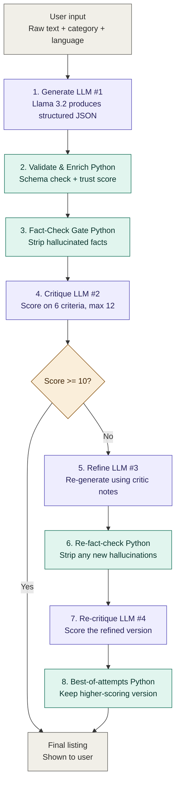

# 🛍️ KOLO Listing Assistant

> An offline AI tool that transforms rough, informal merchant inputs into polished, trust-optimized marketplace listings — running entirely on a local LLM, with no paid APIs and no internet required at runtime.


---

## 📖 Overview

The **KOLO Listing Assistant** is a capstone project built for **CAP 942 — Capstone Project: AI Application Development**. It solves a concrete problem faced by informal-market merchants in West Africa: rough, unstructured marketplace listings that lose buyers and reduce trust scores.

A merchant types a brief, casual description — for example, _"iphone 12 good condition 128gb black with charger 150000 fcfa"_ — and the application returns a structured, polished listing with a title, description, suggested category, tags, two quality scores, and a ready-to-send WhatsApp pitch. Everything runs locally on the user's machine through [Ollama](https://ollama.com), with no data ever leaving the device.

What makes this project distinctive is the **multi-step LLM pipeline with deterministic Python guardrails**: the system makes up to 4 LLM calls per request (generate → critique → refine → re-critique) and uses Python between every LLM call to validate, fact-check, score, and pick the best result.

---

## ✨ Features

- 🎯 **Single-input simplicity** — paste a rough description, get a polished listing in seconds
- 🔁 **Multi-step LLM chain** — generate → critique → refine, with Python fact-check gates between steps
- 🛡️ **Anti-hallucination fact-check** — Python deterministically strips invented prices, brands, and accessories before they reach the user
- 🔍 **Self-critique** — a second LLM scores the first LLM's output on 6 quality criteria
- ✨ **Conditional refinement** — refinement triggers only when the critic score falls below threshold
- 🌍 **Explicit bilingual support** — French / English toggle in the UI (no probabilistic language detection)
- 🛡️ **Buyer Trust Score** — 0–100 score measuring how much info the merchant provided
- ✍️ **AI Quality Score** — 0–12 score measuring how well the AI wrote the listing
- 💬 **WhatsApp pitch** — copy-paste-ready conversational message for buyers
- 🤖 **Transparent AI process panel** — UI exposes every pipeline step with status, timing, and decisions
- 🔒 **Fully offline** — no API keys, no paid services, no data leaves your machine
- 📸 **Photo support** _(v2, optional)_ — upload a product image for vision-augmented generation _(planned)_

---

## 🏗️ Architecture

KOLO Listing Assistant uses a **multi-step LLM pipeline with deterministic Python guardrails**. The system makes up to 4 LLM calls per request (generate → critique → refine → re-critique), with Python steps between every LLM call to validate, score, fact-check, and pick the best result.



A polished PNG version of this diagram lives at [`docs/images/architecture-diagram.png`](docs/images/architecture-diagram.png).

### Design Principle: LLM for Understanding, Python for Decisions

Every Python step represents a deliberate engineering choice where I moved a deterministic decision OUT of the LLM, because small LLMs are unreliable at tasks Python solves perfectly:

| Decision                            | Why moved to Python                                     |
| ----------------------------------- | ------------------------------------------------------- |
| Trust score arithmetic              | LLM sometimes reported 9 when criteria summed to 11     |
| Critic total score                  | Same arithmetic unreliability                           |
| Verdict / threshold decision        | LLM said PASS while score was below threshold           |
| Trust explanation text              | LLM contradicted its own boolean signals                |
| `has_price` detection               | LLM was inconsistent; regex is 100% reliable            |
| Fact-checking against hallucination | Deterministic guarantee, not instruction-following hope |

This is the project's strongest design pattern: **the LLM does the qualitative semantic work; Python handles every quantitative or pattern-matching decision.**

---

## 🛠️ Tech Stack

| Layer               | Tool                              | Purpose                                      |
| ------------------- | --------------------------------- | -------------------------------------------- |
| Language            | Python 3.11                       | Application logic                            |
| Package Manager     | [UV](https://docs.astral.sh/uv/)  | Fast, reproducible Python project management |
| LLM Runtime         | [Ollama](https://ollama.com)      | Local model hosting                          |
| Text Model          | Llama 3.2 3B                      | Generation, critique, refinement             |
| Vision Model _(v2)_ | LLaVA 7B                          | Photo-based extraction (planned)             |
| UI Framework        | [Streamlit](https://streamlit.io) | Web interface                                |
| Image Handling      | Pillow                            | Image preprocessing (v2)                     |

---

## 📦 Installation

### Prerequisites

- **macOS, Linux, or Windows** with at least **16 GB RAM**
- **Python 3.11+** (UV will install this for you if missing)
- **Ollama** ([download](https://ollama.com/download))
- **~3 GB free disk space** for model weights

> **Tested on:** Apple M1 Pro, 16 GB RAM, macOS. Performance: ~5–15 seconds per generation (longer when refinement triggers).

### Step 1 — Install UV

UV is a fast, modern Python package manager that handles virtual environments and dependencies in one tool.

```bash
# macOS / Linux
curl -LsSf https://astral.sh/uv/install.sh | sh

# Windows (PowerShell)
# powershell -ExecutionPolicy ByPass -c "irm https://astral.sh/uv/install.ps1 | iex"

# Verify
uv --version
```

### Step 2 — Install Ollama and pull the model

```bash
# macOS / Linux
curl -fsSL https://ollama.com/install.sh | sh

# Pull the text model (~2.0 GB)
ollama pull llama3.2:3b

# Optional: pull the vision model for v2 photo support (~4.7 GB)
ollama pull llava:7b
```

Verify Ollama is running:

```bash
ollama list
```

### Step 3 — Clone the repository

```bash
git clone https://github.com/demboss01/kolo-listing-assistant.git
cd kolo-listing-assistant
```

### Step 4 — Sync dependencies

UV reads `pyproject.toml` and `uv.lock` to install everything in a managed virtual environment automatically:

```bash
uv sync
```

That single command replaces `python -m venv venv && source venv/bin/activate && pip install -r requirements.txt`. Everything is installed in `.venv/` and locked to the exact versions in `uv.lock`.

### Step 5 — Run the application

```bash
uv run streamlit run app.py
```

The app will open automatically at `http://localhost:8501`.

---

## 🚀 Usage

1. **Select an output language** (French / English) in the sidebar.
2. **Select a product category** from the sidebar dropdown.
3. **Paste your rough listing** into the text area — informal language is fine.
4. **Optionally click a Quick Example preset** (iPhone, Yamaha, Perfume, or Vague) to see how the system handles different input qualities.
5. **Click "Optimize Listing"** and wait a few seconds (5–15 typically).
6. **Review the structured output** on the right: title, description, tags, two scores, and WhatsApp pitch.
7. **Expand the AI Process panel** to see each pipeline step (Generate → Validate → Enrich → Fact-Check → Critique → optional Refine → Best-of-attempts) with status and timing.
8. **Copy the pitch** with one click and paste it into WhatsApp.

### Example

**Input:** _"iphone 12 good condition 128gb black with charger 150000 fcfa"_ (English selected)

**Output:**

```
Title:               iPhone 12 in Good Condition with Charger
Category:            Phones & Tablets
Tags:                iphone, apple, smartphone, 128gb, black
Buyer Trust Score:   95 / 100
AI Quality Score:    12 / 12 PASS
Pitch:               Get this iPhone 12 in good condition with charger
                     for 150,000 FCFA. Perfect for those looking for a
                     reliable phone at an affordable price.
```

---

## 📁 Project Structure

```
kolo-listing-assistant/
├── app.py                          # Streamlit entry point (UI + pipeline trace display)
├── pyproject.toml                  # UV project manifest
├── uv.lock                         # Locked dependency versions
├── .python-version                 # Python 3.11 pinned
├── README.md                       # This file
├── IMPLEMENTATION.md               # Step-by-step build guide
├── LICENSE                         # MIT License
├── .gitignore
│
├── src/
│   ├── __init__.py
│   ├── llm_client.py               # Ollama client (generate_listing)
│   ├── response_parser.py          # Validation + Python-side trust score + explanation
│   ├── fact_checker.py             # Anti-hallucination gate (regex + lexicon)
│   ├── critic.py                   # Self-critique LLM call + scoring
│   ├── refiner.py                  # Refinement LLM call
│   └── orchestrator.py             # Full pipeline (generate → critique → refine → best-of-N)
│
├── prompts/
│   ├── listing_prompt.txt          # Initial generation prompt
│   ├── critique_prompt.txt         # 6-criterion critique prompt
│   └── refine_prompt.txt           # Refinement prompt with anti-hallucination rules
│
├── docs/
│   ├── proposal.pdf                # CAP 942 project proposal
│   ├── architecture.mmd            # Mermaid source for the pipeline diagram
│   ├── images/
│   │   └── architecture-diagram.png # Rendered architecture diagram for slides
│   └── presentation.pdf            # Final presentation slides (forthcoming)
│
└── examples/
    ├── sample_inputs.json          # Test cases for demos
    └── sample_outputs.json         # Expected outputs
```

---

## 🎓 Academic Context

This project was developed for **CAP 942 — Capstone Project: AI Application Development**. It satisfies the course requirements:

- ✅ Uses an open-source LLM (Llama 3.2 3B via Ollama)
- ✅ Accepts user input and produces LLM-generated output
- ✅ Runs as a Streamlit web application
- ✅ Implements a **multi-step LLM chain** (generate → critique → refine → re-critique) for advanced rubric credit
- ✅ Operates entirely without paid APIs

For the full problem statement, methodology, and design rationale, see [`docs/proposal.pdf`](docs/proposal.pdf).

---

## 🗺️ Roadmap

- [x] Project proposal submitted
- [x] Repository scaffolded with UV
- [x] Core prompt templates developed
- [x] LLM client and response parser implemented
- [x] Multi-step LLM chain (critic + refiner)
- [x] Python fact-check gate (anti-hallucination)
- [x] Streamlit UI with bilingual toggle and pipeline trace
- [x] Architecture diagram and README documentation
- [ ] Vision model integration (v2, optional, pending advisor confirmation)
- [ ] Final presentation deck and backup demo video
- [ ] Final submission to Canvas

---

## ⚠️ Known Limitations

- **Cold-start latency** — the first generation after launching the app takes ~10 seconds while the model loads into memory. Subsequent generations are faster (~5–15 seconds depending on whether refinement triggers).
- **3B-model trade-offs** — Llama 3.2 3B occasionally produces broken-sentence text on very sparse inputs (e.g. literally "phone for sale"). The fact-check gate guarantees no fabricated facts, but stripping invented words can leave terse output. This is a deliberate trade-off in favor of honesty over polish.
- **Output variability** — LLM responses are non-deterministic by design. The same input may produce slightly different outputs across runs. The critique-and-refine loop is meant to absorb most of this variance.
- **Vision model _(v2, planned)_** — vision-augmented generation is in the project plan but not yet implemented. Final inclusion depends on advisor guidance.
- **Hardware dependency** — performance is best on Apple Silicon or recent Intel/AMD machines with 16 GB+ RAM. On lower-end hardware, expect longer per-step latency.

---

## 🤝 Contributing

This is a graded academic project and is not currently accepting external contributions. Once the course has concluded, contributions and forks are welcome.

---

## 📜 License

This project is released under the [MIT License](LICENSE). You are free to use, modify, and distribute it with attribution.

---

## 🙏 Acknowledgments

- The CAP 942 instructional team for the capstone framework
- [Astral](https://astral.sh) for [UV](https://docs.astral.sh/uv/), the package manager used in this project
- [Ollama](https://ollama.com) for making local LLM hosting effortless
- [Meta AI](https://ai.meta.com) for releasing Llama 3.2 under an open license
- The KOLO marketplace project, which inspired the problem framing

---

## 📬 Contact

**Author:** Mamadou Dembele
**Course:** CAP 942 — Capstone Project: AI Application Development
**GitHub:** [@demboss01](https://github.com/demboss01)
**Repository:** [demboss01/kolo-listing-assistant](https://github.com/demboss01/kolo-listing-assistant)

For questions about the project, open an [issue](https://github.com/demboss01/kolo-listing-assistant/issues) on this repository.
